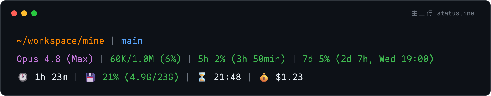
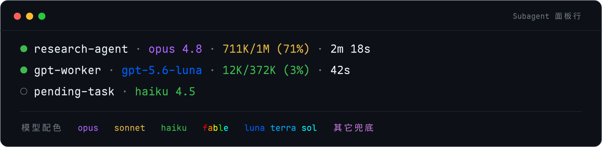

# Claude Code 自定义 Statusline

> 为 Claude Code 定制的状态栏渲染脚本：**无网络请求、不读凭据、事件驱动**。完整设计与验收记录见 [DESIGN.md](DESIGN.md)。

本仓库包含**两个相互独立**的渲染部分，各由 `settings.json` 的不同字段驱动、互不共享代码：

1. **主三行 statusline**（`statusline-command.sh`，由 `statusLine.command` 驱动）——底部状态栏三行：
   - 第 1 行「我在哪」：路径 | Git 分支
   - 第 2 行「当前状态」：模型 (Effort) | Token 用量 | 5h 配额 | 7d 配额
   - 第 3 行「会话运行时」：会话时长 | 内存 | 缓存过期时刻 | 花费
2. **Subagent 面板行**（`subagent-statusline.sh`，由 `subagentStatusLine.command` 驱动）——subagent 面板中每个正在运行的 Task 渲染一行：
   - `状态点 · 名称 · 模型 · 上下文占用 · 运行时长`

## 渲染样例

主三行 statusline（黑底、真实 ANSI 配色还原）：



<details><summary>纯文本样例</summary>

```
~/workspace/mine | main
Opus 4.8 (Max) | 60K/1.0M (6%) | 5h 2% (3h 50min) | 7d 5% (2d 7h, Wed 19:00)
🕐 1h 23m | 💾 21% (4.9G/23G) | ⏳ 21:48 | 💰 $1.23
```

</details>

Subagent 面板行（模型段按档位 / 系列上色，颜色本身即成本信号）：



<details><summary>纯文本样例</summary>

```
● research-agent · opus 4.8 · 711K/1M (71%) · 2m 18s
● gpt-worker · gpt-5.6-luna · 12K/372K (3%) · 42s
○ pending-task · haiku 4.5
```

</details>

模型配色：Claude 系列 `opus` 紫 / `sonnet` 黄 / `haiku` 绿 / `fable` 逐字符七彩；GPT 系列 `luna`→`terra`→`sol` 由蓝到青渐变；未知模型兜底品红。模型名美化（`opus-4-8[1m]` → `opus 4.8`）**仅作用于 Claude 系列**，GPT 等非 `claude-` 前缀保持原生 ID。

> 上面两张图由 `render.sh` 从 `assets/*.svg` 渲染而来（本机 Maple 字体烤入 2x 位图）。改了配色 / 文案后重跑 `bash render.sh` 即可刷新，`bash render_test.sh` 校验产物尺寸与非空白。

## 特性亮点

- **无网络请求、不读任何凭据**：所有数据来自 stdin 快照、`/proc/meminfo` 与 transcript 末尾若干行。
- **事件驱动 + 300ms 防抖**：仅在新 assistant 消息 / `/compact` / permission mode 变更 / vim mode 切换时重跑，空闲时静止、不轮询。
- **数据缺失即降级**：任一段数据缺失则该段（含前导分隔符）整段隐藏；某一行全部缺失则该行不输出（不留空行），绝不阻塞渲染。
- **三档变色**：Token 用量、5h/7d 配额、第 3 行 RAM 统一 `<50%` 绿 / `50–79%` 黄 / `≥80%` 红。
- **缓存过期用绝对时刻**：显示 prompt cache 失效的本地时刻（`⏳ 21:48`）而非相对倒计时——只依赖「起算点 + TTL」，一次算出永不过时，**无需定时刷新、零空闲开销**。TTL 从 transcript 的 `cache_creation` 拆分动态读真实值（5m / 1h）。

## 依赖

- `bash`
- `jq`（数值计算、JSON 提取与转义）
- `git`（分支 / dirty 计数，主脚本）
- GNU `date`（`%s%3N` 取毫秒、`date -d` 解析时刻）
- 可读 `/proc/meminfo`（主脚本的内存段）

均为 coreutils / 常见命令，无网络、无外部服务依赖。

## 安装（换机 / 全新 clone）

仓库自包含，但有两处「仓库外」接线不随 git 走、换机需重建：① `~/.claude/commands/` 下发现 `/statusline-mine` 的软链；② `settings.json` 里指向脚本的两个 `command` 字段。二者分工明确、**不重复实现**。两步即可：

```bash
# 第 1 步（shell）：clone（放哪都行，install.sh 会自适应实际路径）+ 建命令软链
git clone <repo> ~/.claude/statusline
bash ~/.claude/statusline/install.sh

# 第 2 步（Claude Code 内）：激活——把 statusLine / subagentStatusLine 指向本仓库脚本
/statusline-mine
```

- **`install.sh` 只建命令软链**（`~/.claude/commands/statusline-mine.md` → 仓库内真实文件），注册 `/statusline-mine` 命令——这是命令自身无法自举的唯一一步（软链没建好命令就不存在）。它**刻意不写 `settings.json`**，激活交给 `/statusline-mine`，避免两份逻辑漂移。
- `install.sh` 路径自适应（由脚本自身位置推导仓库根，clone 到任意目录都对）、尊重 `CLAUDE_CONFIG_DIR`、幂等、改动前一律备份、绝不静默删除、无 `jq` 依赖。
- **`/statusline-mine` 负责激活**：用 `jq` 把 `.statusLine.command` 与 `.subagentStatusLine.command` 一并指向本仓库脚本，先写临时文件再原子 `mv`，其余设置一个不动。两字段均热重载、无需重启，下一次刷新事件即生效。

## 使用 / 切换

- `/statusline-mine`：一键把 `statusLine` + `subagentStatusLine` 一并切回本仓库脚本（主三行 + subagent 面板行全套），热重载即时生效。
- 与 **claude-hud** 的关系：claude-hud 的 `/claude-hud:setup` 只改写主 `statusLine.command`，**完全不碰 `subagentStatusLine`**（plugin 机制不能声明主 `statusLine`），故切到 hud 只影响主三行，本仓库的 subagent 面板行照常生效。两个方向各改各的字段，均热重载。详见 [DESIGN.md · 与 claude-hud 切换对比](DESIGN.md#与-claude-hud-切换对比)。

## 文件结构

| 文件 | 作用 |
|---|---|
| `statusline-command.sh` | 主三行 statusline 脚本（`statusLine.command` 驱动） |
| `subagent-statusline.sh` | Subagent 面板行脚本（`subagentStatusLine.command` 驱动） |
| `statusline-mine.md` | `/statusline-mine` slash 命令**真实文件**；靠 `~/.claude/commands/` 下同名软链被 Claude Code 发现 |
| `install.sh` | 一次性安装脚本，**只**建命令软链、注册 `/statusline-mine`（换机 / 全新 clone 后运行） |
| `assets/*.svg` | README 渲染样例的**矢量源**（`font-family` 设为 Maple） |
| `assets/*.png` | README 实际展示的 **2x 高清位图**（Maple 已烤入，零字体依赖） |
| `render.sh`<br>`render_test.sh` | 把 `assets/` 下 SVG 现渲染成 2x PNG 的脚本，及其测试（TDD） |
| `verify_statusline.sh`<br>`verify_line3.sh` | 主 statusline 端到端验证脚本 |
| `DESIGN.md` | 完整设计文档（各段规格、验收记录、已知限制） |
| `INVESTIGATION-cost-duration-reset.md` | cost / 时长在 session 切换时行为的调查记录 |
| `debug.json` | 主 statusline 运行时调试输出（每次覆盖写入，不含任何凭据） |

各文件细节以 [DESIGN.md · 文件清单](DESIGN.md#文件清单) 为准。

## 延伸阅读

- [DESIGN.md](DESIGN.md)：完整设计、各区域规格、配色、降级规则与端到端验收记录。
- [INVESTIGATION-cost-duration-reset.md](INVESTIGATION-cost-duration-reset.md)：为何第 3 行时长 / 花费是「进程级」累计、`/clear` 与 `/resume` 的重置行为调查。
